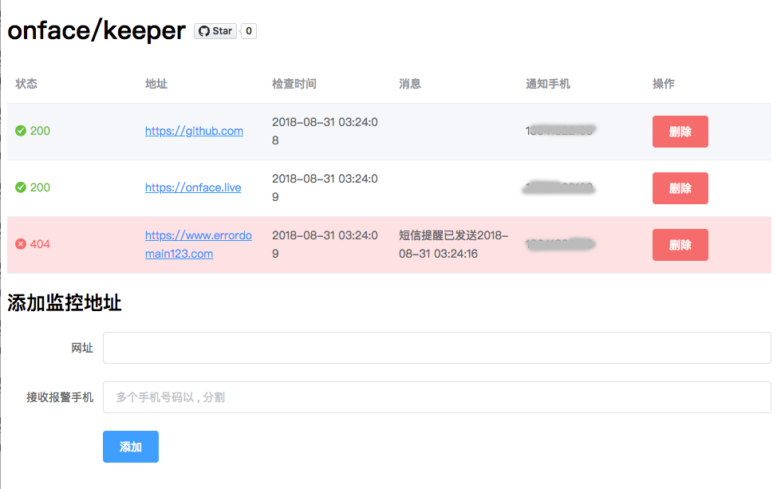

# keeper



## install

```shell
git clone https://github.com/onface/keeper.git
cd keeper
docker build . -t onface/keeper
docker volume create onface-keeper
docker run -d  -env SMS_API_USER=username SMS_API_PWD=password -p 4121:4121  --mount source=onface-keeper,target=/app/data onface/keeper
```

## debug

```bash
docker run -it -env SMS_API_USER=username SMS_API_PWD=password  -p 4121:4121  --mount source=onface-keeper,target=/app/data onface/keeper bash
```
